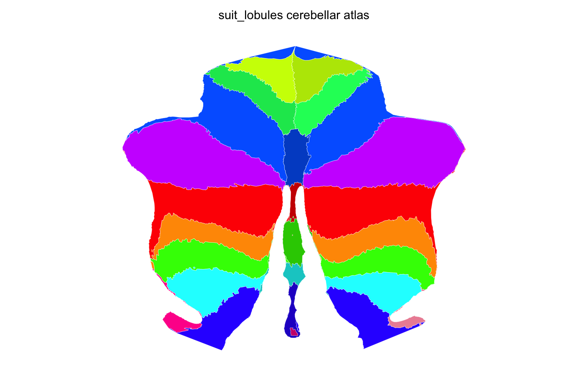
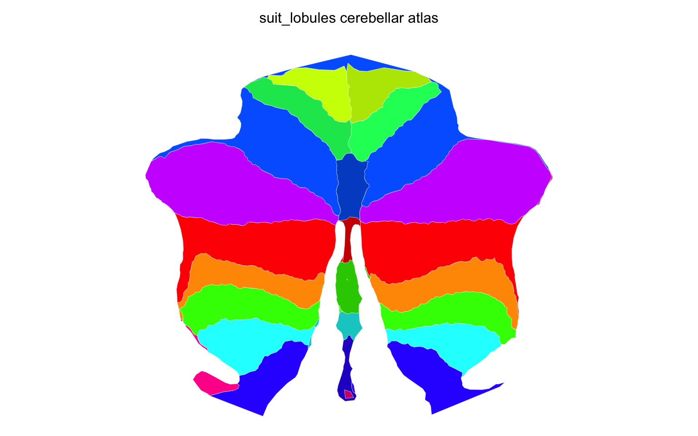

The cerebellum sits beneath the cortex and behind the brainstem, folded into tight folia that make it awkward to visualize on a standard brain surface.
The [SUIT template](https://www.diedrichsenlab.org/imaging/suit.htm) solves this by providing a dedicated cerebellar surface with a 2D flatmap projection — the same kind of unfolding that cartographers use to flatten a globe.

ggseg.extra ships both SUIT surfaces (flatmap and 3D pial) and provides three creation functions depending on what format your parcellation is in.
The result is a `ggseg_atlas` of type `"cerebellar"` that works with both `ggplot() + geom_brain()` for 2D flatmap plots and `ggseg3d()` for interactive 3D views.

## What you need

The cerebellar pipeline has lighter dependencies than the cortical or subcortical pipelines.
No FreeSurfer installation is required for GIFTI or annotation inputs — the SUIT surfaces are bundled with the package.

For volume-based cerebellar atlases, you need FreeSurfer (for mesh tessellation) and a NIfTI segmentation already in SUIT space.


``` r
library(ggseg.extra)
library(dplyr)
```

## Three ways in

The pipeline you use depends on the format of your cerebellar parcellation:

- **GIFTI label files** (`.label.gii` or `.func.gii`) on the SUIT surface — the most common format for Diedrichsen Lab atlases.
  Use `create_cerebellar_from_gifti()`.
- **FreeSurfer annotation files** (`.annot`) painted on the SUIT surface.
  Use `create_cerebellar_from_annotation()`.
- **NIfTI volumes** containing a voxel-wise segmentation of the cerebellum.
  Use `create_cerebellar_from_volume()`.

All three produce the same output: a `ggseg_atlas` with SUIT flatmap polygons for 2D plotting.
The volume pathway also generates 3D meshes automatically.
For the GIFTI and annotation pathways, pass a matching `volume` argument if you want 3D meshes too.

## Creating from GIFTI labels

SUIT-space GIFTI label files are the standard output from the Diedrichsen Lab cerebellar atlases.
Each file maps every vertex on the SUIT surface to a region label.

The lobular parcellation that ships with SUIT lives in the Diedrichsen Lab's
[cerebellar_atlases](https://github.com/DiedrichsenLab/cerebellar_atlases) repository, as `atl-Anatom_dseg.label.gii`.
It is 12 KB, so fetching it is quick:


``` r
url <- paste0(
  "https://raw.githubusercontent.com/DiedrichsenLab/cerebellar_atlases/",
  "master/Diedrichsen_2009/atl-Anatom_dseg.label.gii"
)
suit_labels <- file.path(tempdir(), "atl-Anatom_dseg.label.gii")
download.file(url, suit_labels, mode = "wb")
```


``` r
atlas <- create_cerebellar_from_gifti(
  gifti_files = suit_labels,
  atlas_name = "suit_lobules"
)

atlas
#> 
#> ── suit_lobules ggseg atlas ────────────────────────────────────────────────────
#> Type: cerebellar
#> Regions: 11
#> Hemispheres: left, right, vermis, midline
#> Views: flatmap
#> Palette: ✔
#> Rendering: ✔ ggseg
#> ✔ ggseg3d (vertices)
#> ────────────────────────────────────────────────────────────────────────────────
#>      hemi region       label
#> 1    left   I_IV   left_I_IV
#> 2   right   I_IV  right_I_IV
#> 3    left      V      left_V
#> 4   right      V     right_V
#> 5    left     VI     left_VI
#> 6  vermis     VI   vermis_VI
#> 7   right     VI    right_VI
#> 8    left  CrusI  left_CrusI
#> 9   right  CrusI right_CrusI
#> 10   left CrusII left_CrusII
#> ... with 17 more rows
```


``` r
plot(atlas)
```

<div class="figure">

<p class="caption">Stage 1 --- straight out of the pipeline, at flatmap mesh resolution.</p>
</div>

Every lobule boundary is a chain of triangle edges, which is why the outlines look sampled rather than drawn.

The pipeline reads the GIFTI label table for region names and colours, maps labels onto the SUIT flatmap vertices, and builds per-region sf polygons from the mesh triangles. It does not simplify them --- the polygons arrive at mesh resolution, and tidying is the separate step below.

If you also have a matching NIfTI volume and want 3D meshes:


``` r
atlas <- create_cerebellar_from_gifti(
  gifti_files = "atl-Anatom_dseg.label.gii",
  volume = "atl-Anatom_space-SUIT_dseg.nii",
  atlas_name = "suit_lobules"
)
```

## Creating from annotation files

Some cerebellar parcellations exist as FreeSurfer `.annot` files painted on the SUIT surface rather than GIFTI labels.
The interface is the same:


``` r
atlas <- create_cerebellar_from_annotation(
  input_annot = "cerebellum.annot",
  atlas_name = "cerebellar_annot"
)
```

This requires the `freesurferformats` package to read the annotation.

## Creating from a volume

When your parcellation is a NIfTI volume — either natively in SUIT space or transformed there — the volume pathway handles both 2D flatmap projection _and_ 3D mesh tessellation in one call:


``` r
atlas <- create_cerebellar_from_volume(
  input_volume = "cerebellar_parcellation.nii.gz",
  input_lut = "cerebellar_lut.txt",
  atlas_name = "cerebellar_vol"
)
```

The `input_lut` argument accepts a FreeSurfer-style colour lookup table file or a data.frame with columns `idx`, `label`, and optionally `R`, `G`, `B`.
A data.frame can also carry a `hemi` column, covered below.
If omitted, labels are auto-generated from the unique non-zero values in the volume.

Under the hood, the pipeline samples the volume onto the SUIT 3D pial surface, fills any unlabelled vertices using a two-stage neighbour search (voxel neighbours first, then mesh neighbours via majority vote), and projects the result onto the flatmap.
The 3D meshes are tessellated from the volume using FreeSurfer tools, so this pathway requires a FreeSurfer installation.

## Transforming MNI volumes to SUIT space

Many cerebellar parcellations ship in MNI152 space rather than SUIT space.
The package provides helpers to handle the transform before you run the pipeline:


``` r
xfm <- suit_deformation_field(template = "MNI152NLin6AsymC")

suit_volume <- transform_mni_to_suit(
  input_volume = "cerebellar_atlas_mni.nii.gz",
  deformation_field = xfm,
  interpolation = "nearest"
)
```

`suit_deformation_field()` downloads and caches the nonlinear warp field (~13 MB) from the Diedrichsen Lab.
Two MNI templates are supported:

- `"MNI152NLin6AsymC"` — the FSL/FreeSurfer MNI template.
  Use this for FreeSurfer's Buckner cerebellar atlases.
- `"MNI152NLin2009cSymC"` — the ICBM 2009c symmetric template.

Use `interpolation = "nearest"` for label maps (the default) and `"linear"` for continuous maps like PET receptor densities.

After the transform, pass the SUIT-space volume to `create_cerebellar_from_volume()` as usual.

## Tidying the geometry

The cerebellar pipeline now returns raw, unsmoothed flatmap polygons.
Tidying them is a separate post-processing step in two parts — `atlas_simplify()` drops vertices, `atlas_smooth()` rounds off what is left — so you can tune either without re-running the pipeline:


``` r
sum(count_vertices(atlas))
#> [1] 9463

atlas <- atlas |>
  atlas_simplify(keep = 0.2, exclude = context_pattern) |>
  atlas_smooth(exclude = context_pattern)

sum(count_vertices(atlas))
#> [1] 2627
```


``` r
plot(atlas)
```

<div class="figure">

<p class="caption">Stage 2 --- simplified and smoothed.</p>
</div>

Roughly three quarters of the vertices are gone and the lobules read more clearly for it --- the flatmap is a schematic, so nothing is lost by drawing it as one.

For 3D meshes, `decimate` controls quadric edge decimation (0–1, default 0.5).
A value of 0.5 reduces the mesh to roughly half its original vertex count.

The `tolerance`, `smoothness` and `smooth_refinements` arguments on the `create_*()` functions are gone.
Shape the geometry after the build instead: see `atlas_polish()`.

## Post-processing

The same post-processing tools from the other tutorials work here. What needs removing depends on the parcellation, so look before you cut:


``` r
atlas_regions(atlas)
#>  [1] "CrusI"     "CrusII"    "I_IV"      "IX"        "region_28" "V"        
#>  [7] "VI"        "VIIb"      "VIIIa"     "VIIIb"     "X"
```

`region_28` is the giveaway --- a midline strip the parcellation numbers but does not name. Drop it:


``` r
atlas <- atlas_region_remove(atlas, "region_28", match_on = "region")
```

Cerebellar atlases use hemisphere values `"left"`, `"right"`, and `"vermis"` — the pipeline detects these from region name prefixes like "Left I-IV", "Right Crus I", or "Vermis VI".
A label whose name says none of these is filed under `"midline"`.
When the names can't be relied on, pass `input_lut` as a data.frame with a `hemi` column: a value there (`"left"`, `"right"`, `"vermis"` or `"midline"`) is used instead of the name, a row left `NA` is still read from its name, and anything else is an error.
The `region` column has the hemisphere prefix stripped and the remainder sanitised, so you get `I_IV` and `CrusI` rather than "Left I-IV" and "Right Crus I".

## Visualization


``` r
plot(atlas)
```

<div class="figure">

<p class="caption">Stage 3 --- the finished atlas, after the unwanted regions are dropped.</p>
</div>

The 2D plot shows the SUIT flatmap — the cerebellum unfolded with the vermis in the centre, left hemisphere on the left, right on the right.

If your atlas includes 3D meshes:


``` r
ggseg3d::ggseg3d(atlas = atlas)
```

## Saving

Follow the same convention as other atlas packages:


``` r
usethis::use_data(atlas, compress = "xz", overwrite = TRUE)
```

For atlas packages with both 2D and 3D data, see `setup_atlas_repo()` for the standard scaffolding.

## Cerebellar regions in whole-brain atlases

If your parcellation volume contains cerebellar labels alongside cortical and subcortical structures, you don't need to run the cerebellar pipeline separately.
`create_wholebrain_from_volume()` detects cerebellar labels and routes them through this pipeline automatically — see the [whole-brain tutorial](tutorial-wholebrain-atlas.html) for details.
