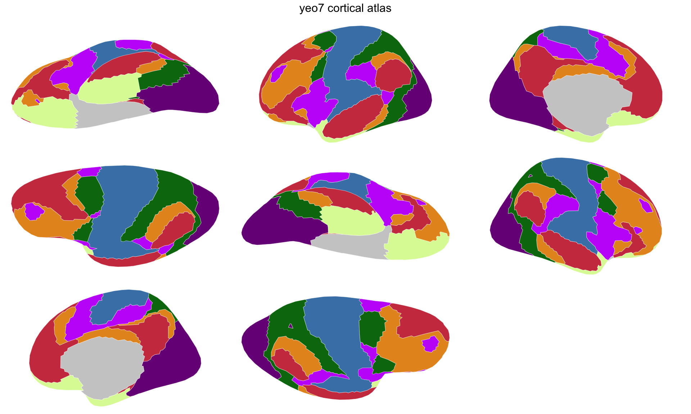

Cortical parcellations divide the brain surface into labelled regions.
They come from FreeSurfer annotation files, where each vertex on the cortical mesh is assigned to a region like "superior frontal gyrus" or "precuneus."

This tutorial walks through the full pipeline for turning an annotation into a `ggseg_atlas` you can plot with ggseg and ggseg3d.
We'll use the Yeo 7-network parcellation as a working example --- it has only 7 regions per hemisphere, so the pipeline runs quickly.

## What you need

- The `freesurferformats` R package (reads `.annot` files; no FreeSurfer
  installation required)
- The `fsaverage5` subject directory (ships with a FreeSurfer install, or
  can be downloaded separately)


``` r
library(ggseg.extra)
library(ggseg.formats)
library(dplyr)
```

## Locating annotation files

FreeSurfer stores annotation files alongside the subject's surface data.
You need the full paths to the `lh.` and `rh.` annotation files:


``` r
fs_dir <- freesurfer::fs_dir()
subjects_dir <- file.path(fs_dir, "subjects")

annot_files <- file.path(
  subjects_dir, "fsaverage5", "label",
  c("lh.Yeo2011_7Networks_N1000.annot",
    "rh.Yeo2011_7Networks_N1000.annot")
)

all(file.exists(annot_files))
#> [1] TRUE
```

## Creating the atlas

The pipeline reads the annotation, extracts vertex-to-region assignments, and
projects the inflated mesh triangles directly to 2D polygons via orthographic
projection. This is fast (seconds, not minutes) and requires no external
dependencies beyond FreeSurfer for reading the annotation:


``` r
output_dir <- file.path(tempdir(), "yeo7_tutorial")

yeo7_raw <- create_cortical_from_annotation(
  input_annot = annot_files,
  atlas_name = "yeo7",
  output_dir = output_dir,
  skip_existing = TRUE,
  cleanup = FALSE,
  verbose = TRUE
)
#> 
#> ── Creating brain atlas "yeo7" ─────────────────────────────────────────────────
#> ℹ Input files: '$FREESURFER_HOME/subjects/fsaverage5/label/lh.Yeo2011_7Networks_N1000.annot' and '$FREESURFER_HOME/subjects/fsaverage5/label/rh.Yeo2011_7Networks_N1000.annot'
#> ℹ Reading annotation files
#> ✔ Reading annotation files [112ms]
#> 
#> ℹ Projecting mesh to 2D polygons
#> ℹ Projecting "rh" "lateral"
#> ℹ Projecting mesh to 2D polygons
ℹ Projecting "rh" "medial"
#> ℹ Projecting mesh to 2D polygons
ℹ Projecting "rh" "superior"
#> ℹ Projecting mesh to 2D polygons
ℹ Projecting "rh" "inferior"
#> ℹ Projecting mesh to 2D polygons
ℹ Projecting "lh" "lateral"
#> ℹ Projecting mesh to 2D polygons
ℹ Projecting "lh" "medial"
#> ℹ Projecting mesh to 2D polygons
ℹ Projecting "lh" "superior"
#> ℹ Projecting mesh to 2D polygons
ℹ Projecting "lh" "inferior"
#> ℹ Projecting mesh to 2D polygons
✔ Projecting mesh to 2D polygons [6s]
#> 
#> ✔ Brain atlas created with 14 regions
#> ℹ Pipeline completed [6.2s]
#> Warning: Atlas has 21514 vertices (threshold: 10000)
#> ℹ Large atlases may be slow to plot and increase package size
#> ℹ Call `atlas_simplify(atlas, keep = 0.2)`, then `atlas_smooth(atlas)`, to tidy
#>   it and reduce vertices

yeo7_raw
#> 
#> ── yeo7 ggseg atlas ────────────────────────────────────────────────────────────
#> Type: cortical
#> Regions: 7
#> Hemispheres: left, right
#> Views: inferior, lateral, medial, superior
#> Palette: ✔
#> Rendering: ✔ ggseg
#> ✔ ggseg3d (vertices)
#> ────────────────────────────────────────────────────────────────────────────────
#>     hemi      region          label
#> 1   left 7Networks_1 lh_7Networks_1
#> 2   left 7Networks_2 lh_7Networks_2
#> 3   left 7Networks_3 lh_7Networks_3
#> 4   left 7Networks_4 lh_7Networks_4
#> 5   left 7Networks_5 lh_7Networks_5
#> 6   left 7Networks_6 lh_7Networks_6
#> 7   left 7Networks_7 lh_7Networks_7
#> 8  right 7Networks_1 rh_7Networks_1
#> 9  right 7Networks_2 rh_7Networks_2
#> 10 right 7Networks_3 rh_7Networks_3
#> ... with 4 more rows
```

A few things to note about the parameters:

- **`cleanup = FALSE`** keeps intermediate files (cached step 1 data) so you can re-run without re-reading annotations.
- **`skip_existing = TRUE`** reuses existing intermediate files when resuming an interrupted run.

This is the atlas at its roughest, and it is worth looking at before tidying anything:


``` r
plot(yeo7_raw)
```

<div class="figure">

<p class="caption">Stage 1 --- straight out of the pipeline. The boundaries still follow the mesh triangles.</p>
</div>

Every boundary is a staircase. The pipeline traces the edges of mesh triangles, so each region's outline is made of the vertices it inherited rather than a line anyone would draw by hand. `count_vertices()` gives the price of that:


``` r
sum(count_vertices(yeo7_raw))
#> [1] 21514
```

The `create_*()` functions warn above ten thousand, because an atlas that heavy is slow to plot and bulky to ship.

## Tidying the geometry

Tidying is a separate post-processing step in two parts: `atlas_simplify()` drops vertices, `atlas_smooth()` rounds off what is left. Tune either freely; you no longer have to re-run the full pipeline to try a different level.

Take them one at a time, so you can see what each does. Simplification first:


``` r
yeo7_simple <- atlas_simplify(yeo7_raw, keep = 0.2, exclude = "cortex_")

sum(count_vertices(yeo7_simple))
#> [1] 5189
```


``` r
plot(yeo7_simple)
```

<div class="figure">

<p class="caption">Stage 2 --- simplified. Most of the vertices are gone; the corners they left behind are not.</p>
</div>

`exclude = "cortex_"` leaves the brain-outline geometry crisp while simplifying the labelled regions.

Simplification is topology-aware, so neighbouring regions lose the same vertices and no gaps open between them. What it does not do is make anything look smooth --- it removes vertices from a jagged line and leaves a jagged line with fewer vertices. That is what `atlas_smooth()` is for:


``` r
yeo7_smooth <- atlas_smooth(yeo7_simple, exclude = "cortex_")

sum(count_vertices(yeo7_smooth))
#> [1] 6793
```


``` r
plot(yeo7_smooth)
```

<div class="figure">

<p class="caption">Stage 3 --- smoothed. The staircases are gone.</p>
</div>

Notice the count went **up**. Rounding a corner means inserting vertices, so smoothing gives some of the budget back --- and it is still a large cut on where we started. Simplify first and smooth afterwards, so the smoothing has the last word on the outline.

## Background regions

That grey mass on the medial views is the medial wall --- the part of the surface with no cortex to parcellate. It is drawn, because leaving a hole there would be worse, but it is not one of the atlas's regions. The pipeline already sorted that out:


``` r
length(unique(atlas_sf(yeo7_smooth)$label))
#> [1] 16
length(atlas_regions(yeo7_smooth))
#> [1] 7
```

Sixteen labels carry geometry; seven are regions you can fill with data. The medial wall is *context*: `create_cortical_from_annotation()` sets aside any region whose whole name is `unknown` or `???`, or whose name ends in "medial wall" (with a space, underscore, dot, hyphen or nothing in between). Case does not matter.

Which is fine until a parcellation names its leftovers something else. FreeSurfer's own `aparc` labels the callosal region `corpuscallosum`, and that matches none of the above --- so it would arrive as an ordinary region, coloured and listed alongside the real ones. `atlas_region_contextual()` is how you set one aside by hand. It keeps the geometry for spatial reference and drops the region from `$core`:


``` r
dk <- create_cortical_from_annotation(dk_annots, atlas_name = "dk")
dk <- atlas_region_contextual(dk, "corpuscallosum", match_on = "region")
```

Check `atlas_regions()` after a pipeline run; anything in that list you would not want to colour by data belongs in a call like this one.

## Adding metadata

The atlas has region names derived from the annotation file.
For the Yeo atlas, they are numeric network IDs.
Map them to descriptive names on `region` rather than `label` --- the label
carries a hemisphere prefix (`lh_7Networks_1`), so a table keyed on the bare
network name joins to `region` and matches both hemispheres at once:


``` r
yeo7_metadata <- data.frame(
  region = c(
    "7Networks_1", "7Networks_2", "7Networks_3", "7Networks_4",
    "7Networks_5", "7Networks_6", "7Networks_7"
  ),
  region_pretty = c(
    "visual", "somatomotor", "dorsal attention",
    "ventral attention", "limbic", "frontoparietal", "default"
  )
)

core_with_meta <- yeo7_smooth$core |>
  left_join(yeo7_metadata, by = "region") |>
  mutate(region = coalesce(region_pretty, region)) |>
  select(hemi, region, label)
```

## Rebuilding the atlas

Construct the final atlas from the modified core:


``` r
yeo7 <- ggseg_atlas(
  atlas = yeo7_smooth$atlas,
  type = yeo7_smooth$type,
  palette = yeo7_smooth$palette,
  core = core_with_meta,
  data = yeo7_smooth$data
)

yeo7
#> 
#> ── yeo7 ggseg atlas ────────────────────────────────────────────────────────────
#> Type: cortical
#> Regions: 7
#> Hemispheres: left, right
#> Views: inferior, lateral, medial, superior
#> Palette: ✔
#> Rendering: ✔ ggseg
#> ✔ ggseg3d (vertices)
#> ────────────────────────────────────────────────────────────────────────────────
#>     hemi            region          label
#> 1   left            visual lh_7Networks_1
#> 2   left       somatomotor lh_7Networks_2
#> 3   left  dorsal attention lh_7Networks_3
#> 4   left ventral attention lh_7Networks_4
#> 5   left            limbic lh_7Networks_5
#> 6   left    frontoparietal lh_7Networks_6
#> 7   left           default lh_7Networks_7
#> 8  right            visual rh_7Networks_1
#> 9  right       somatomotor rh_7Networks_2
#> 10 right  dorsal attention rh_7Networks_3
#> ... with 4 more rows
```


``` r
atlas_regions(yeo7) |> sort()
#> [1] "default"           "dorsal attention"  "frontoparietal"   
#> [4] "limbic"            "somatomotor"       "ventral attention"
#> [7] "visual"
```


``` r
plot(yeo7)
```

<div class="figure">

<p class="caption">Stage 4 --- the finished atlas. The geometry is stage 3's; what changed is the names behind it, listed above.</p>
</div>

`plot()` draws geometry, not names, so stage 4 is stage 3's picture --- the renaming shows up in `atlas_regions()` above, and in any plot you fill from your own data.

Side by side with stage 1, that is the whole job: the same parcellation, a fraction of the vertices, and boundaries that look drawn rather than sampled.


``` r
sum(count_vertices(yeo7))
#> [1] 6793
```

## Applying the same pattern to larger atlases

The Yeo 7-network atlas runs in seconds because it has few regions.
Larger atlases like aparc (34 regions/hemisphere) or Glasser (180 regions/hemisphere) take a bit longer but follow the same pattern and still complete in under a minute:


``` r
dk_annots <- file.path(
  subjects_dir, "fsaverage5", "label",
  c("lh.aparc.annot", "rh.aparc.annot")
)

dk <- create_cortical_from_annotation(
  input_annot = dk_annots,
  atlas_name = "dk",
  output_dir = "data-raw"
)
```

## Saving

Once you're satisfied with the atlas, save it as package data:


``` r
usethis::use_data(yeo7, overwrite = TRUE, compress = "xz")
```

The `compress = "xz"` flag gives the best compression for sf geometry data.
