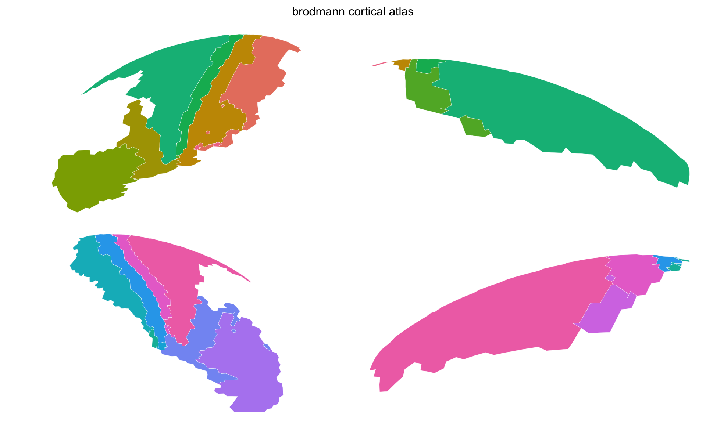
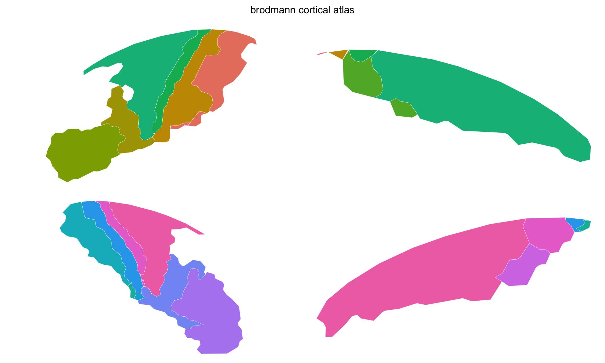
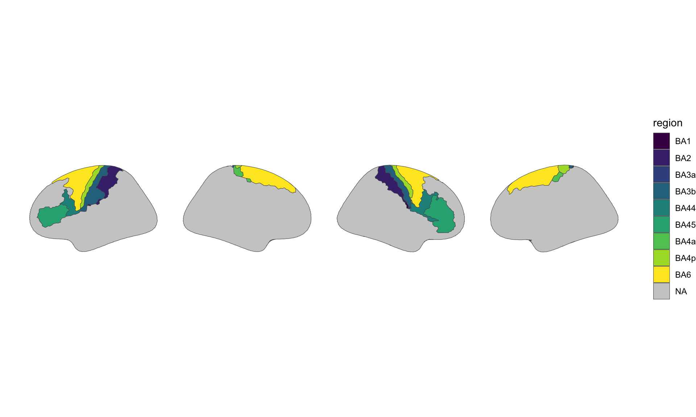

Sometimes you have brain regions defined as individual FreeSurfer label files rather than a complete annotation.
This happens when you extract results from vertex-wise analyses, combine regions from different sources, or work with manually defined ROIs.

`create_cortical_from_labels()` builds an atlas from a collection of `.label` files.

## What label files contain

FreeSurfer label files are text files that list which vertices belong to a region:

```
#!ascii label
5432
1234  -23.5  12.3  45.6  0.0
1235  -23.8  12.1  45.9  0.0
...
```

The first line is a header, the second is the vertex count, and subsequent lines contain the vertex index and its coordinates.
Label files conventionally include hemisphere in the filename: `lh.motor.label` or `rh.motor.label`.


``` r
library(ggseg.extra)
library(ggseg)
library(ggplot2)
library(dplyr)
```

## Basic usage

Collect your label files and create an atlas:


``` r
label_dir <- file.path(
  freesurfer::fs_dir(), "subjects", "fsaverage5", "label"
)

ba_labels <- list.files(
  label_dir,
  pattern = "^[lr]h\\.BA[0-9]+.*\\.label$",
  full.names = TRUE
)

length(ba_labels)
#> [1] 18
head(basename(ba_labels))
#> [1] "lh.BA1_exvivo.label"  "lh.BA2_exvivo.label"  "lh.BA3a_exvivo.label"
#> [4] "lh.BA3b_exvivo.label" "lh.BA44_exvivo.label" "lh.BA45_exvivo.label"
```


``` r
ba_atlas <- create_cortical_from_labels(
  label_files = ba_labels,
  atlas_name = "brodmann"
)

ba_atlas
#> 
#> ── brodmann ggseg atlas ────────────────────────────────────────────────────────
#> Type: cortical
#> Regions: 9
#> Hemispheres: left, right
#> Views: lateral, medial
#> Palette: ✖
#> Rendering: ✔ ggseg
#> ✔ ggseg3d (vertices)
#> ────────────────────────────────────────────────────────────────────────────────
#>     hemi      region          label
#> 1   left  BA1_exvivo  lh_BA1_exvivo
#> 2   left  BA2_exvivo  lh_BA2_exvivo
#> 3   left BA3a_exvivo lh_BA3a_exvivo
#> 4   left BA3b_exvivo lh_BA3b_exvivo
#> 5   left BA44_exvivo lh_BA44_exvivo
#> 6   left BA45_exvivo lh_BA45_exvivo
#> 7   left BA4a_exvivo lh_BA4a_exvivo
#> 8   left BA4p_exvivo lh_BA4p_exvivo
#> 9   left  BA6_exvivo  lh_BA6_exvivo
#> 10 right  BA1_exvivo  rh_BA1_exvivo
#> ... with 8 more rows
```

The function detects hemisphere from filename prefixes (`lh.` or `rh.`) and derives region names from the rest of the filename.

## Custom names and colours

Override auto-detected names when the filenames don't produce readable labels:


``` r
atlas <- create_cortical_from_labels(
  label_files = c(
    "lh.motor.label", "rh.motor.label",
    "lh.visual.label", "rh.visual.label"
  ),
  region_names = c(
    "primary motor", "primary motor",
    "primary visual", "primary visual"
  ),
  colours = c("#E74C3C", "#E74C3C", "#3498DB", "#3498DB")
)
```

Left and right hemisphere versions of the same region should share the same region name --- the hemisphere column distinguishes them.

## The 2D geometry

There is nothing extra to switch on: the call above already ran the full pipeline, the same one behind `create_cortical_from_annotation()`, projecting the inflated mesh triangles straight to 2D and converting them to sf polygons. The atlas is ready to plot.


``` r
atlas_views(ba_atlas)
#> [1] "lateral" "medial"
```


``` r
plot(ba_atlas)
```

<div class="figure">

<p class="caption">Stage 1 --- straight out of the pipeline, boundaries still following the mesh.</p>
</div>

The boundaries are staircases, because the pipeline traces the edges of mesh triangles rather than drawing a line through them.

Four label files cover a small part of the cortex, and the grey behind them is the rest of it.
Any vertex no label claims becomes a silhouette region, `lh_cortex` or `rh_cortex`, so a sparse parcellation still reads as somewhere on a brain rather than as shapes in empty space.
It is context rather than a region: it is not in `$core`, so it takes no colour and no legend entry, and `context_pattern()` matches it when you want to treat it differently from the regions --- as the next section does.

## Tidying the geometry

As with any pipeline output, the polygons arrive at mesh resolution. `atlas_simplify()` drops vertices and `atlas_smooth()` rounds off what is left:


``` r
sum(count_vertices(ba_atlas))
#> [1] 5329

ba_atlas <- ba_atlas |>
  atlas_simplify(keep = 0.2, exclude = context_pattern) |>
  atlas_smooth(exclude = context_pattern)

sum(count_vertices(ba_atlas))
#> [1] 2690
```


``` r
plot(ba_atlas)
```

<div class="figure">

<p class="caption">Stage 2 --- simplified and smoothed.</p>
</div>

Around two thirds of the vertices are gone and the areas read more cleanly, which is the trade this step exists to make.

## Post-processing

Clean up region names:


``` r
core_clean <- ba_atlas$core |>
  mutate(
    region = gsub("\\.", " ", region),
    region = gsub("_exvivo", "", region)
  )

ba_atlas <- ggseg_atlas(
  atlas = ba_atlas$atlas,
  type = ba_atlas$type,
  palette = ba_atlas$palette,
  core = core_clean,
  data = ba_atlas$data
)
```


``` r
ggplot() +
  geom_brain(atlas = ba_atlas, aes(fill = region)) +
  scale_fill_viridis_d(na.value = "grey80") +
  theme_void()
```

<div class="figure">

<p class="caption">Stage 3 --- the finished atlas, drawn through ggplot2 with a viridis fill.</p>
</div>

`plot()` is the quick look --- base graphics, the atlas's own palette, no customisation. When you want to control the colours, go through ggplot2: `geom_brain()` draws the same atlas as a layer you can add scales and themes to. Map something to `fill` when you do, or there is nothing for a fill scale to colour and every region comes back as `na.value`.

## Finding label files

FreeSurfer ships with several sets of label files.
Brodmann areas are the most common:


``` r
label_dir <- file.path(
  freesurfer::fs_dir(), "subjects", "fsaverage5", "label"
)

length(list.files(label_dir, "^[lr]h\\.BA.*\\.label$", full.names = TRUE))
#> [1] 18
```

Other useful labels include V1/V2, MT, and entorhinal cortex.
Any label file that maps to the same surface (typically fsaverage5) can be combined into one atlas.

## Combining regions from different sources

Label-based atlases are useful when you want to mix regions from different analyses or atlases.
Each label file is independent, so you can combine freely:


``` r
my_labels <- c(
  "lh.BA1_exvivo.label",
  "lh.BA2_exvivo.label",
  "lh.V1.label",
  "rh.BA1_exvivo.label",
  "rh.BA2_exvivo.label",
  "rh.V1.label"
)

atlas <- create_cortical_from_labels(
  label_files = file.path(label_dir, my_labels),
  atlas_name = "somatosensory_visual",
  region_names = c(
    "BA1", "BA2", "V1",
    "BA1", "BA2", "V1"
  ),
  colours = c(
    "#E74C3C", "#C0392B", "#3498DB",
    "#E74C3C", "#C0392B", "#3498DB"
  )
)
```

The only constraint is that all label files must reference the same surface mesh.
Labels created for fsaverage won't match fsaverage5 vertices without resampling.
