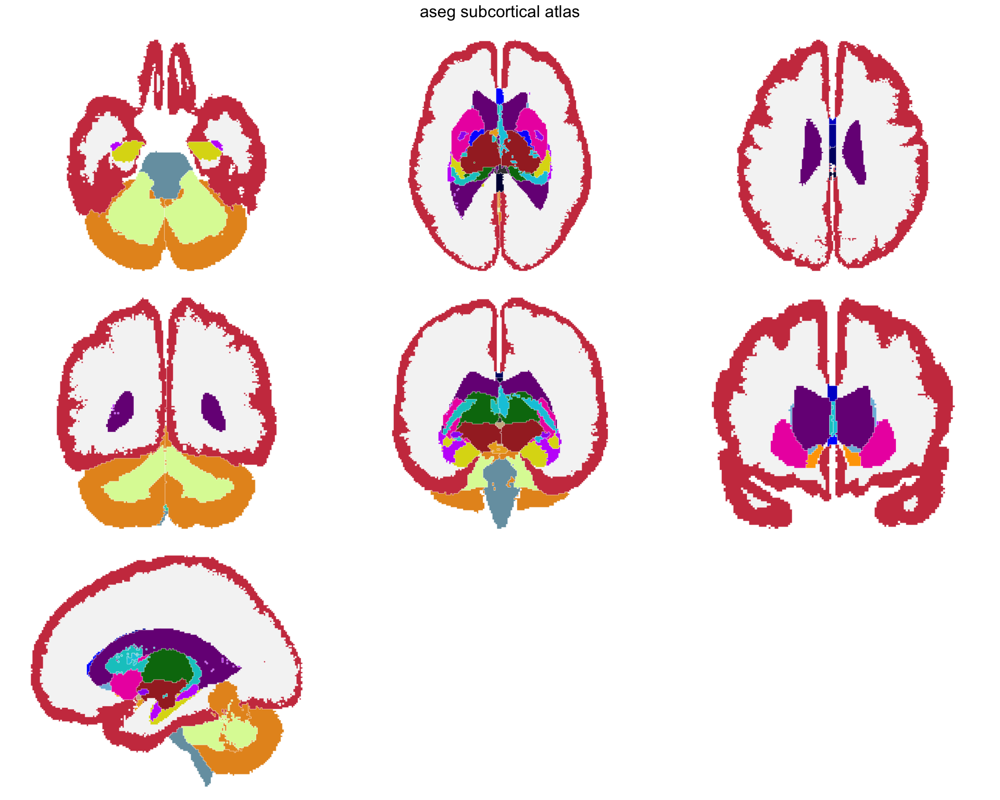
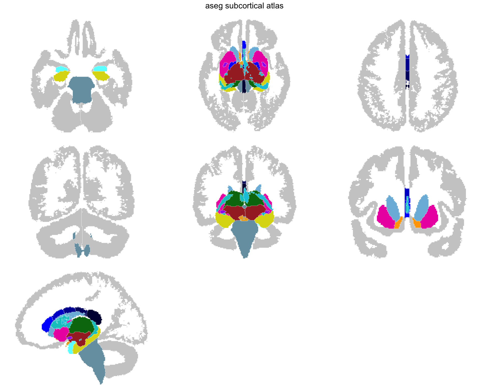
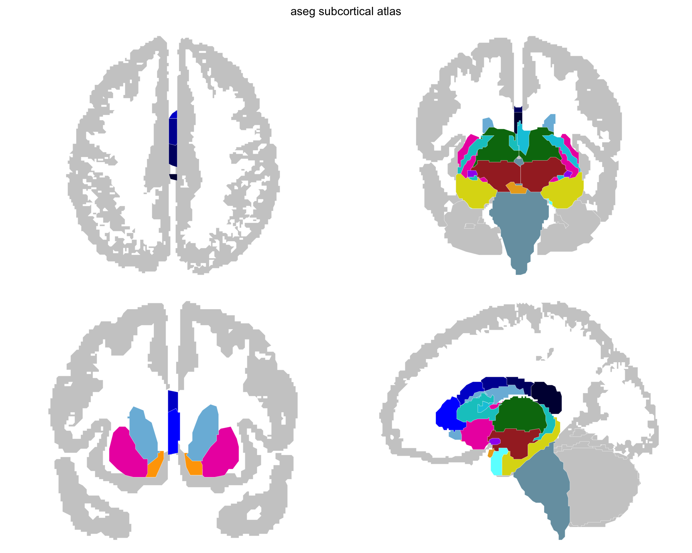

Subcortical atlases represent the structures beneath the cortical surface: thalamus, hippocampus, amygdala, caudate, putamen, and others.
They come from volumetric segmentations like FreeSurfer's `aseg.mgz`, where each voxel is assigned a label.

The pipeline tessellates labelled voxel regions into 3D meshes and (optionally) creates 2D projection views that collapse a slab of the volume onto a single plane.

This tutorial recreates the aseg atlas --- the same pipeline behind `data-raw/make_aseg_atlas.R` in ggseg.formats.

## What you need

- FreeSurfer installed with the `fsaverage5` subject


``` r
library(ggseg.extra)
library(dplyr)
```


``` r
fs_dir <- freesurfer::fs_dir()
subjects_dir <- file.path(fs_dir, "subjects")

aseg_volume <- file.path(subjects_dir, "fsaverage5", "mri", "aseg.mgz")
color_lut <- file.path(fs_dir, "ASegStatsLUT.txt")

if (!file.exists(color_lut)) {
  color_lut <- file.path(fs_dir, "FreeSurferColorLUT.txt")
}
```

## Regions and context

`create_subcortical_from_volume()` takes a segmentation volume and a colour lookup table, and the table does more than name things.
It decides what the atlas is made of:

- a label the table lists is a **region**, with a colour, a 3D mesh and a shape in each 2D view;
- a row whose `context` column is `TRUE` is **context**: grey anatomy the regions are drawn against, with no mesh;
- a label that is in the volume but not in the table is context as well.

Nothing is worked out from a label's id or its name, so the table is where the decision is made.
For a subcortical atlas the cortex is the obvious context --- it shows where the deep structures sit without competing for colour --- so say so before building:


``` r
lut <- read_lut(color_lut)
lut$context <- grepl("Cortex", lut$label)

lut[lut$context, c("idx", "label", "context")]
#>    idx                   label context
#> 3    3    Left-Cerebral-Cortex    TRUE
#> 7    8  Left-Cerebellum-Cortex    TRUE
#> 23  42   Right-Cerebral-Cortex    TRUE
#> 27  47 Right-Cerebellum-Cortex    TRUE
```

Deciding this in the table, rather than turning the cortex grey afterwards, changes how it is drawn.
A region is projected through the whole slab it sits in, which turns a cortical ribbon into a solid shape.
Context is traced on a single slice, so the ribbon keeps its folds.

## Creating the atlas

Each structure's hemisphere is read from its label (`Left-Thalamus`, `Right-Putamen`); if your labels don't carry one, give the table a `hemi` column, as [Lookup tables and colours](tutorial-lookup-tables.html) describes.
The pipeline tessellates each region into a 3D mesh, then creates 2D projection views:


``` r
aseg_raw <- create_subcortical_from_volume(
  input_volume = aseg_volume,
  input_lut = lut,
  atlas_name = "aseg"
)

aseg_raw
#> 
#> ── aseg ggseg atlas ────────────────────────────────────────────────────────────
#> Type: subcortical
#> Regions: 25
#> Hemispheres: left, NA, right
#> Views: axial_1, axial_2, coronal_1, coronal_2, sagittal_left, axial_3,
#> coronal_3
#> Palette: ✔
#> Rendering: ✔ ggseg
#> ✔ ggseg3d (meshes)
#> ────────────────────────────────────────────────────────────────────────────────
#>    hemi                  region                        label
#> 1  left   cerebral white matter   Left-Cerebral-White-Matter
#> 2  left       lateral ventricle       Left-Lateral-Ventricle
#> 3  left            inf lat vent            Left-Inf-Lat-Vent
#> 4  left cerebellum white matter Left-Cerebellum-White-Matter
#> 5  left                thalamus                Left-Thalamus
#> 6  left                 caudate                 Left-Caudate
#> 7  left                 putamen                 Left-Putamen
#> 8  left                pallidum                Left-Pallidum
#> 9  <NA>           3rd ventricle                3rd-Ventricle
#> 10 <NA>           4th ventricle                4th-Ventricle
#> ... with 29 more rows
```


``` r
plot(aseg_raw)
```

<div class="figure">

<p class="caption">Stage 1 --- everything aseg labels, on every view the pipeline made.</p>
</div>

That is the whole segmentation, and it is not yet an atlas anyone would want: white matter dominates the picture, and half the views say the same thing twice. The rest of this tutorial is subtraction.

The default pipeline creates seven projection views focused on the subcortical range: three axial slabs, three coronal slabs, and one sagittal (`axial_1` to `axial_3`, `coronal_1` to `coronal_3`, `sagittal_left`).
Each view collapses a slab of the volume onto a single plane, giving you spatial context without the complexity of individual slices.

## Removing unwanted regions

The aseg segmentation contains everything --- white matter, ventricles, CSF.
For a subcortical atlas, most of these are noise.
Remove them:


``` r
aseg_raw <- aseg_raw |>
  atlas_region_remove("White-Matter", match_on = "label") |>
  atlas_region_remove("WM-hypointensities", match_on = "label") |>
  atlas_region_remove("-Ventricle", match_on = "label") |>
  atlas_region_remove("-Vent$", match_on = "label") |>
  atlas_region_remove("CSF", match_on = "label")
```

Patterns are regular expressions, so `-Vent$` matches "3rd-Vent" and "4th-Vent" without catching "Ventral-DC."


``` r
plot(aseg_raw)
```

<div class="figure">

<p class="caption">Stage 2 --- the structures we actually want, once the bulk tissue is gone.</p>
</div>

The white matter is gone, and what is left is what the atlas is for. The grey cortex stays: the table declared it context, not a region, so it gives the structures somewhere to sit without taking a colour.

## Changing your mind about context

The table is the place to decide, but not the only chance.
`atlas_region_contextual()` turns a region of an atlas you already have into context, and `atlas_context_remove()` drops the context altogether:


``` r
# Grey out the brain stem as well
aseg_raw |>
  atlas_region_contextual("Brain-Stem", match_on = "label")

# No backdrop at all
aseg_raw |>
  atlas_context_remove()
```

A region made context this way keeps the shape it was built with, projected through its slab, so for anything with folds the table gives the better picture.

## Selecting views

Not all projection views are equally useful.
Keep the ones that show your structures best:


``` r
aseg_raw <- aseg_raw |>
  atlas_view_keep("axial_3|coronal_2|coronal_3|sagittal_left")
```


``` r
plot(aseg_raw)
```

<div class="figure">

<p class="caption">Stage 3 --- only the views that show the structures well.</p>
</div>

Three views are gone. Two showed almost nothing, and one added no information while costing as much space as the views that carry the atlas --- the reader still has to check it to find that out.

## Cleaning up the layout

Gather views into a compact arrangement:


``` r
aseg_raw <- aseg_raw |>
  atlas_view_gather()
```


``` r
plot(aseg_raw)
```

<div class="figure">

<p class="caption">Stage 4 --- gathered. Same geometry, less white space.</p>
</div>

Nothing was added or removed here; the views were simply packed together. It matters more than it sounds: an atlas is usually printed small, and the white space between views is space the structures could have had.

## Tidying the geometry

Every outline here is still made of mesh triangle edges, so each nucleus is bounded by a staircase rather than a line anyone would draw. `count_vertices()` gives the price, and says where it is being paid:


``` r
vertices <- count_vertices(aseg_raw)

sum(vertices)
#> [1] 10740
sum(vertices[grepl(context_pattern(aseg_raw), names(vertices))])
#> [1] 7512
```

Most of the atlas is the cortex. That matters for what comes next: the `create_*()` functions warn above ten thousand vertices, and here the context geometry alone accounts for the bulk of it.

Tidying is a separate post-processing step in two parts --- `atlas_simplify()` drops vertices, `atlas_smooth()` rounds off what is left --- and on a subcortical atlas **both have to be applied twice**, because the context and the structures want opposite things. The silhouette is only useful while its sulci and gyri survive, so it needs gentle settings; the nuclei need firmer ones to read as smooth shapes. A single pass tuned for nuclei flattens the cortical ribbon into a blob.

Simplify each separately. `context_pattern`, handed over without brackets, selects whatever this atlas draws as context:


``` r
aseg_raw <- aseg_raw |>
  atlas_simplify(keep = 0.5, labels = context_pattern) |>
  atlas_simplify(keep = 0.25, exclude = context_pattern)

sum(count_vertices(aseg_raw))
#> [1] 6728
```


``` r
plot(aseg_raw)
```

<div class="figure">

<p class="caption">Stage 5 --- simplified. Most of the vertices are gone; the corners they left behind are not.</p>
</div>

`keep = 0.5` on the context is deliberately mild. It drops roughly a quarter of the contour rings, which is a real loss, but the alternative is a silhouette whose sulci close up as soon as it is smoothed. Simplification is topology-aware, so neighbouring structures lose the same vertices and no gaps open between them.

Then smooth each separately, and note the second argument:


``` r
aseg_raw <- aseg_raw |>
  atlas_smooth(
    smoothness = 0.35,
    labels = context_pattern,
    method = "chaikin"
  ) |>
  atlas_smooth(smoothness = 0.4, exclude = context_pattern)

sum(count_vertices(aseg_raw))
#> [1] 8821
```


``` r
plot(aseg_raw)
```

<div class="figure">

<p class="caption">Stage 6 --- smoothed. The staircases are gone and the silhouette still has its folds.</p>
</div>

`method = "chaikin"` is not optional for the context. The default `close` dilates and then erodes, which fills any hole narrower than the smoothing distance --- and on a cortex silhouette those holes are the sulci, so the default destroys exactly what the context is for. Chaikin's corner-cutting preserves rings instead.

Notice that the count went back up. Smoothing is not a reduction step: chaikin subdivides each corner it cuts, and `close` resamples what it traces. Simplify to set the budget, smooth to set the look, and read the total after both rather than after either.

These four numbers --- two thresholds and two smoothing strengths --- are the ones worth experimenting with, and none of them requires re-running the pipeline.

## Adding metadata

The raw labels are technical identifiers like "Left-Thalamus-Proper."
Join human-readable names and structural groupings:


``` r
normalize_region <- function(x) {
  ifelse(
    is.na(x),
    NA_character_,
    x |>
      tolower() |>
      gsub("-", " ", x = _) |>
      gsub("_", " ", x = _) |>
      gsub("left |right ", "", x = _) |>
      trimws()
  )
}

aseg_metadata <- data.frame(
  region = c(
    "Thalamus-Proper", "Caudate", "Putamen", "Pallidum",
    "Hippocampus", "Amygdala", "Accumbens-area", "VentralDC",
    "Brain-Stem"
  ),
  label_pretty = c(
    "thalamus", "caudate", "putamen", "pallidum",
    "hippocampus", "amygdala", "nucleus accumbens", "ventral DC",
    "brain stem"
  ),
  structure = c(
    "diencephalon", "basal ganglia", "basal ganglia", "basal ganglia",
    "limbic", "limbic", "basal ganglia", "diencephalon",
    "brainstem"
  )
)

core_with_meta <- aseg_raw$core |>
  mutate(region_key = normalize_region(region)) |>
  left_join(
    aseg_metadata |>
      mutate(region_key = normalize_region(region)) |>
      select(region_key, label_pretty, structure),
    by = "region_key"
  ) |>
  mutate(region = coalesce(label_pretty, region)) |>
  select(hemi, region, label, structure)
```

## Rebuilding and saving

Construct the final atlas from modified components:


``` r
aseg <- ggseg_atlas(
  atlas = aseg_raw$atlas,
  type = aseg_raw$type,
  palette = aseg_raw$palette,
  core = core_with_meta,
  data = aseg_raw$data
)

aseg
#> 
#> ── aseg ggseg atlas ────────────────────────────────────────────────────────────
#> Type: subcortical
#> Regions: 17
#> Hemispheres: left, NA, right
#> Views: axial_3, coronal_2, coronal_3, sagittal_left
#> Palette: ✔
#> Rendering: ✔ ggseg
#> ✔ ggseg3d (meshes)
#> ────────────────────────────────────────────────────────────────────────────────
#>    hemi            region               label     structure
#> 1  left          thalamus       Left-Thalamus          <NA>
#> 2  left           caudate        Left-Caudate basal ganglia
#> 3  left           putamen        Left-Putamen basal ganglia
#> 4  left          pallidum       Left-Pallidum basal ganglia
#> 5  <NA>        brain stem          Brain-Stem     brainstem
#> 6  left       hippocampus    Left-Hippocampus        limbic
#> 7  left          amygdala       Left-Amygdala        limbic
#> 8  left nucleus accumbens Left-Accumbens-area basal ganglia
#> 9  left        ventral DC      Left-VentralDC  diencephalon
#> 10 left            vessel         Left-vessel          <NA>
#> ... with 17 more rows
```


``` r
sort(atlas_labels(aseg))
#>  [1] "Brain-Stem"           "CC_Anterior"          "CC_Central"          
#>  [4] "CC_Mid_Anterior"      "CC_Mid_Posterior"     "CC_Posterior"        
#>  [7] "Left-Accumbens-area"  "Left-Amygdala"        "Left-Caudate"        
#> [10] "Left-choroid-plexus"  "Left-Hippocampus"     "Left-Pallidum"       
#> [13] "Left-Putamen"         "Left-Thalamus"        "Left-VentralDC"      
#> [16] "Left-vessel"          "Optic-Chiasm"         "Right-Accumbens-area"
#> [19] "Right-Amygdala"       "Right-Caudate"        "Right-choroid-plexus"
#> [22] "Right-Hippocampus"    "Right-Pallidum"       "Right-Putamen"       
#> [25] "Right-Thalamus"       "Right-VentralDC"      "Right-vessel"

table(aseg$core$structure)
#> 
#> basal ganglia     brainstem  diencephalon        limbic 
#>             8             1             2             4
```


``` r
plot(aseg)
```

<div class="figure">

<p class="caption">Stage 7 --- the finished atlas. Same geometry as stage 6; what changed is the names behind it.</p>
</div>
