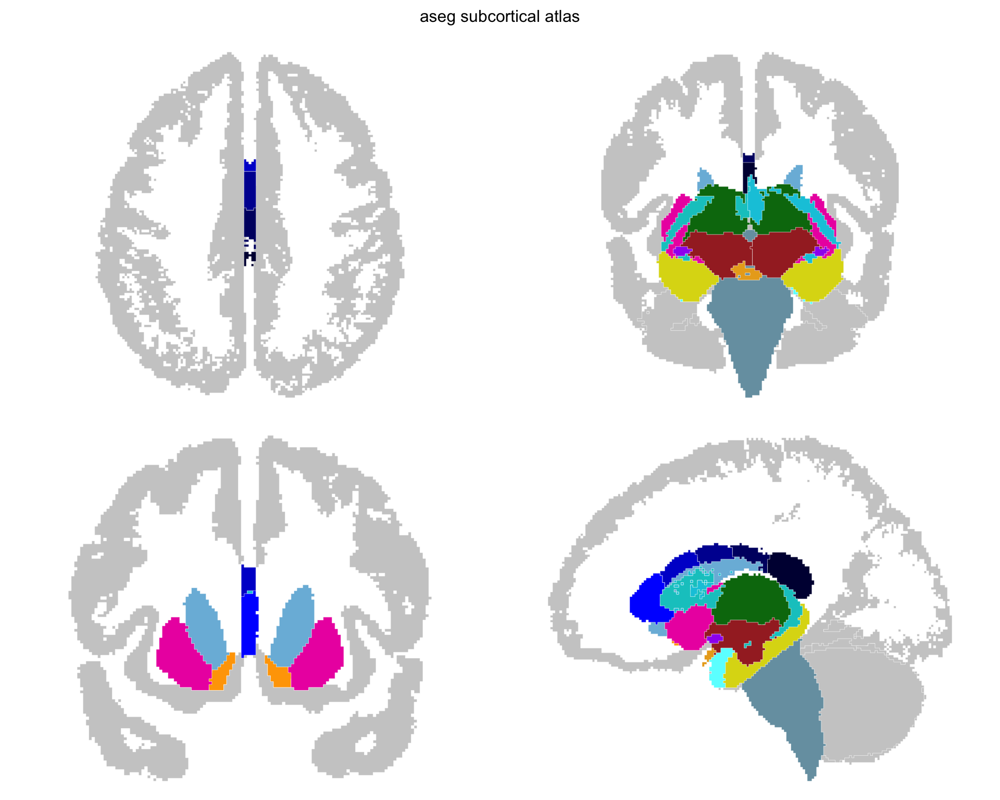

Subcortical atlases represent the structures beneath the cortical surface: thalamus, hippocampus, amygdala, caudate, putamen, and others.
They come from volumetric segmentations like FreeSurfer's `aseg.mgz`, where each voxel is assigned a label.

The pipeline tessellates labelled voxel regions into 3D meshes and (optionally) creates 2D projection views that collapse a slab of the volume onto a single plane.

This tutorial recreates the aseg atlas --- the same pipeline behind `data-raw/make_aseg_atlas.R` in ggseg.formats.

## What you need

- FreeSurfer installed with the `fsaverage5` subject


``` r
library(ggseg.extra)
library(ggseg.formats)
library(dplyr)
```


``` r
fs_dir <- freesurfer::fs_dir()
subjects_dir <- file.path(fs_dir, "subjects")

aseg_volume <- file.path(subjects_dir, "fsaverage5", "mri", "aseg.mgz")
color_lut <- file.path(fs_dir, "ASegStatsLUT.txt")

if (!file.exists(color_lut)) {
  color_lut <- file.path(fs_dir, "FreeSurferColorLUT.txt")
}
```

## Creating the atlas

`create_subcortical_from_volume()` takes a segmentation volume and a colour lookup table.
The pipeline tessellates each labelled region into a 3D mesh, then creates 2D projection views:


``` r
aseg_raw <- create_subcortical_from_volume(
  input_volume = aseg_volume,
  input_lut = color_lut,
  atlas_name = "aseg"
)
#> Warning: Atlas has 31614 vertices (threshold: 10000)
#> ℹ Large atlases may be slow to plot and increase package size
#> ℹ Call `atlas_simplify(atlas, keep = 0.2)`, then `atlas_smooth(atlas)`, to tidy
#>   it and reduce vertices

aseg_raw
#> 
#> ── aseg ggseg atlas ────────────────────────────────────────────────────────────
#> Type: subcortical
#> Regions: 27
#> Hemispheres: left, NA, right
#> Views: axial_1, axial_2, axial_3, coronal_1, coronal_2, coronal_3,
#> sagittal_left
#> Palette: ✔
#> Rendering: ✔ ggseg
#> ✔ ggseg3d (meshes)
#> ────────────────────────────────────────────────────────────────────────────────
#>    hemi                  region                        label
#> 1  left   cerebral white matter   Left-Cerebral-White-Matter
#> 2  left         cerebral cortex         Left-Cerebral-Cortex
#> 3  left       lateral ventricle       Left-Lateral-Ventricle
#> 4  left            inf lat vent            Left-Inf-Lat-Vent
#> 5  left cerebellum white matter Left-Cerebellum-White-Matter
#> 6  left       cerebellum cortex       Left-Cerebellum-Cortex
#> 7  left                thalamus                Left-Thalamus
#> 8  left                 caudate                 Left-Caudate
#> 9  left                 putamen                 Left-Putamen
#> 10 left                pallidum                Left-Pallidum
#> ... with 33 more rows
```

The default pipeline creates six projection views focused on the subcortical range:
axial inferior, axial superior, coronal posterior, coronal anterior, sagittal left, and sagittal right.
Each view collapses a slab of the volume onto a single plane, giving you spatial context without the complexity of individual slices.

## Removing unwanted regions

The aseg segmentation contains everything --- cortex, white matter, ventricles, CSF.
For a subcortical atlas, most of these are noise.
Remove them:


``` r
aseg_raw <- aseg_raw |>
  atlas_region_remove("White-Matter", match_on = "label") |>
  atlas_region_remove("WM-hypointensities", match_on = "label") |>
  atlas_region_remove("-Ventricle", match_on = "label") |>
  atlas_region_remove("-Vent$", match_on = "label") |>
  atlas_region_remove("CSF", match_on = "label") |>
  atlas_region_remove("Cerebral-Cortex", match_on = "label")
```

Patterns are regular expressions, so `-Vent$` matches "3rd-Vent" and "4th-Vent" without catching "Ventral-DC."

## Setting context regions

The cortex works well as a background outline --- it shows where subcortical structures sit relative to the brain surface without competing for colour:


``` r
aseg_raw <- aseg_raw |>
  atlas_region_contextual("Cortex", match_on = "label")
```

## Selecting views

Not all projection views are equally useful.
Keep the ones that show your structures best:


``` r
aseg_raw <- aseg_raw |>
  atlas_view_keep("axial_3|axial_5|coronal_2|coronal_3|coronal_4|sagittal")
```

## Cleaning up the layout

Gather views into a compact arrangement:


``` r
aseg_raw <- aseg_raw |>
  atlas_view_gather()
```

## Adding metadata

The raw labels are technical identifiers like "Left-Thalamus-Proper."
Join human-readable names and structural groupings:


``` r
normalize_region <- function(x) {
  ifelse(
    is.na(x),
    NA_character_,
    x |>
      tolower() |>
      gsub("-", " ", x = _) |>
      gsub("_", " ", x = _) |>
      gsub("left |right ", "", x = _) |>
      trimws()
  )
}

aseg_metadata <- data.frame(
  region = c(
    "Thalamus-Proper", "Caudate", "Putamen", "Pallidum",
    "Hippocampus", "Amygdala", "Accumbens-area", "VentralDC",
    "Brain-Stem"
  ),
  label_pretty = c(
    "thalamus", "caudate", "putamen", "pallidum",
    "hippocampus", "amygdala", "nucleus accumbens", "ventral DC",
    "brain stem"
  ),
  structure = c(
    "diencephalon", "basal ganglia", "basal ganglia", "basal ganglia",
    "limbic", "limbic", "basal ganglia", "diencephalon",
    "brainstem"
  )
)

core_with_meta <- aseg_raw$core |>
  mutate(region_key = normalize_region(region)) |>
  left_join(
    aseg_metadata |>
      mutate(region_key = normalize_region(region)) |>
      select(region_key, label_pretty, structure),
    by = "region_key"
  ) |>
  mutate(region = coalesce(label_pretty, region)) |>
  select(hemi, region, label, structure)
```

## Rebuilding and saving

Construct the final atlas from modified components:


``` r
aseg <- ggseg_atlas(
  atlas = aseg_raw$atlas,
  type = aseg_raw$type,
  palette = aseg_raw$palette,
  core = core_with_meta,
  data = aseg_raw$data
)

aseg
#> 
#> ── aseg ggseg atlas ────────────────────────────────────────────────────────────
#> Type: subcortical
#> Regions: 17
#> Hemispheres: left, NA, right
#> Views: axial_3, coronal_2, coronal_3, sagittal_left
#> Palette: ✔
#> Rendering: ✔ ggseg
#> ✔ ggseg3d (meshes)
#> ────────────────────────────────────────────────────────────────────────────────
#>    hemi            region               label     structure
#> 1  left          thalamus       Left-Thalamus          <NA>
#> 2  left           caudate        Left-Caudate basal ganglia
#> 3  left           putamen        Left-Putamen basal ganglia
#> 4  left          pallidum       Left-Pallidum basal ganglia
#> 5  <NA>        brain stem          Brain-Stem     brainstem
#> 6  left       hippocampus    Left-Hippocampus        limbic
#> 7  left          amygdala       Left-Amygdala        limbic
#> 8  left nucleus accumbens Left-Accumbens-area basal ganglia
#> 9  left        ventral DC      Left-VentralDC  diencephalon
#> 10 left            vessel         Left-vessel          <NA>
#> ... with 17 more rows
```


``` r
atlas_labels(aseg)
#>  [1] "Brain-Stem"           "CC_Anterior"          "CC_Central"          
#>  [4] "CC_Mid_Anterior"      "CC_Mid_Posterior"     "CC_Posterior"        
#>  [7] "Left-Accumbens-area"  "Left-Amygdala"        "Left-Caudate"        
#> [10] "Left-choroid-plexus"  "Left-Hippocampus"     "Left-Pallidum"       
#> [13] "Left-Putamen"         "Left-Thalamus"        "Left-VentralDC"      
#> [16] "Left-vessel"          "Optic-Chiasm"         "Right-Accumbens-area"
#> [19] "Right-Amygdala"       "Right-Caudate"        "Right-choroid-plexus"
#> [22] "Right-Hippocampus"    "Right-Pallidum"       "Right-Putamen"       
#> [25] "Right-Thalamus"       "Right-VentralDC"      "Right-vessel"

table(aseg$core$structure)
#> 
#> basal ganglia     brainstem  diencephalon        limbic 
#>             8             1             2             4
```


``` r
plot(aseg)
```

<div class="figure">

<p class="caption">Subcortical aseg atlas plotted with ggseg.</p>
</div>
