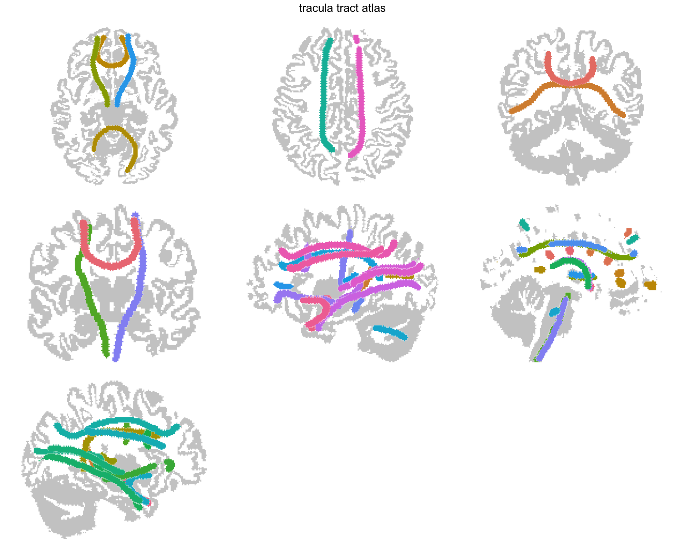

Tract atlases represent white matter pathways derived from diffusion MRI tractography.
Unlike cortical or subcortical atlases where regions are contiguous surfaces, tracts are tube-like structures that follow streamline bundles through the brain.

The pipeline reads tractography files, computes a centerline for each tract, wraps it in a tube mesh, and (optionally) creates 2D projection views.

This tutorial recreates the TRACULA atlas --- the same pipeline behind `data-raw/make_tracula_atlas.R` in ggseg.formats.

## What you need

- FreeSurfer installed with TRACULA training data (`trctrain/`)


``` r
library(ggseg.extra)
library(ggseg.formats)
library(dplyr)
```

## Finding tractography files

TRACULA training data ships with FreeSurfer in the `trctrain/` directory.
Each `.trk` file contains streamlines for one tract:


``` r
fs_dir <- freesurfer::fs_dir()
tract_dir <- file.path(fs_dir, "trctrain", "hcp", "mgh_1017", "mni")

tract_files <- list.files(tract_dir, pattern = "\\.trk$", full.names = TRUE)
aseg_file <- file.path(tract_dir, "aparc+aseg.nii.gz")

length(tract_files)
#> [1] 42
```

The `aparc+aseg.nii.gz` provides cortex outlines for 2D projections.
If it's missing, you can still create a 3D-only atlas.

## Creating the atlas

`create_tract_from_tractography()` reads each tractography file, computes a centerline, and generates a tube mesh around it.
The `input_aseg` provides cortex context for 2D views:


``` r
tracula_raw <- create_tract_from_tractography(
  input_tracts = tract_files,
  input_aseg = aseg_file,
  atlas_name = "tracula"
)
#> Warning: Atlas has 58862 vertices (threshold: 10000)
#> ℹ Large atlases may be slow to plot and increase package size
#> ℹ Call `atlas_simplify(atlas, keep = 0.2)`, then `atlas_smooth(atlas)`, to tidy
#>   it and reduce vertices

tracula_raw
#> 
#> ── tracula ggseg atlas ─────────────────────────────────────────────────────────
#> Type: tract
#> Regions: 26
#> Hemispheres: midline, left, right
#> Views: axial_1, axial_2, axial_3, axial_4, axial_5, coronal_1, coronal_2,
#> coronal_3, coronal_4, coronal_5, coronal_6, sagittal_midline, sagittal_left,
#> sagittal_right
#> Palette: ✖
#> Rendering: ✔ ggseg
#> ✔ ggseg3d (centerlines)
#> ────────────────────────────────────────────────────────────────────────────────
#>       hemi               region                label
#> 1  midline       acomm.bbr.prep       acomm.bbr.prep
#> 2  midline    cc.bodyc.bbr.prep    cc.bodyc.bbr.prep
#> 3  midline    cc.bodyp.bbr.prep    cc.bodyp.bbr.prep
#> 4  midline   cc.bodypf.bbr.prep   cc.bodypf.bbr.prep
#> 5  midline   cc.bodypm.bbr.prep   cc.bodypm.bbr.prep
#> 6  midline    cc.bodyt.bbr.prep    cc.bodyt.bbr.prep
#> 7  midline     cc.genu.bbr.prep     cc.genu.bbr.prep
#> 8  midline  cc.rostrum.bbr.prep  cc.rostrum.bbr.prep
#> 9  midline cc.splenium.bbr.prep cc.splenium.bbr.prep
#> 10    left          af.bbr.prep       lh.af.bbr.prep
#> ... with 32 more rows
```

Key parameters:

- **`tube_radius`** controls tube thickness. Larger values make tracts more visible at the cost of anatomical precision.
- **`tube_segments`** controls the number of vertices around the tube circumference. Six gives hexagonal cross-sections; 12+ gives smoother tubes.
- **`n_points`** controls centerline resolution. More points capture finer curvature.

## Post-processing

### Selecting views

Keep the projections that show your tracts best:


``` r
tracula_raw <- tracula_raw |>
  atlas_view_keep(c(
    "axial_2",
    "axial_4",
    "coronal_3",
    "coronal_4",
    "sagittal"
  ))
```

### Setting context regions

Add cortex as a background outline:


``` r
tracula_raw <- tracula_raw |>
  atlas_region_contextual("cortex")
```

### Removing small fragments

After view selection, some tracts may appear as tiny slivers in certain views.
Remove fragments below a minimum area:


``` r
tracula_raw <- tracula_raw |>
  atlas_view_remove_small(
    min_area = 500,
    views = c("axial", "coronal")
  ) |>
  atlas_view_remove_small(min_area = 50)
#> ℹ Removed 98 geometries below area 500
#> ℹ Removed 12 geometries below area 50
```

The first call applies a higher threshold to axial and coronal views (where tracts appear in cross-section and produce small dots).
The second call applies a lower threshold everywhere to catch remaining slivers.

## Adding metadata

Join tract group information --- which tracts are projection fibres, which are commissural, which are association:


``` r
normalize_label <- function(x) {
  x |>
    basename() |>
    tools::file_path_sans_ext()
}

tracula_metadata <- data.frame(
  label_key = c(
    "lh.cst.bbr.prep", "rh.cst.bbr.prep",
    "lh.ilf.bbr.prep", "rh.ilf.bbr.prep",
    "lh.unc.bbr.prep", "rh.unc.bbr.prep",
    "lh.atr.bbr.prep", "rh.atr.bbr.prep",
    "lh.cab.bbr.prep", "rh.cab.bbr.prep",
    "lh.slfp.bbr.prep", "rh.slfp.bbr.prep",
    "lh.slft.bbr.prep", "rh.slft.bbr.prep",
    "lh.ccg.bbr.prep", "rh.ccg.bbr.prep",
    "fmajor.bbr.prep", "fminor.bbr.prep"
  ),
  region = c(
    "corticospinal tract", "corticospinal tract",
    "inferior longitudinal fasciculus", "inferior longitudinal fasciculus",
    "uncinate fasciculus", "uncinate fasciculus",
    "anterior thalamic radiation", "anterior thalamic radiation",
    "cingulum (angular bundle)", "cingulum (angular bundle)",
    "SLF (parietal)", "SLF (parietal)",
    "SLF (temporal)", "SLF (temporal)",
    "cingulum (cingulate gyrus)", "cingulum (cingulate gyrus)",
    "forceps major", "forceps minor"
  ),
  group = c(
    "projection", "projection",
    "association", "association",
    "association", "association",
    "projection", "projection",
    "limbic", "limbic",
    "association", "association",
    "association", "association",
    "limbic", "limbic",
    "commissural", "commissural"
  )
)

core_with_meta <- tracula_raw$core |>
  mutate(label_key = normalize_label(label)) |>
  left_join(
    tracula_metadata |> select(label_key, region_pretty = region, group),
    by = "label_key"
  ) |>
  mutate(region = coalesce(region_pretty, region)) |>
  select(hemi, region, label, group)
```

## Rebuilding and saving


``` r
tracula <- ggseg_atlas(
  atlas = "tracula",
  type = "tract",
  palette = tracula_raw$palette,
  core = core_with_meta,
  data = tracula_raw$data
)

tracula
#> 
#> ── tracula ggseg atlas ─────────────────────────────────────────────────────────
#> Type: tract
#> Regions: 26
#> Hemispheres: midline, left, right
#> Views: axial_2, axial_4, coronal_3, coronal_4, sagittal_midline, sagittal_left,
#> sagittal_right
#> Palette: ✖
#> Rendering: ✔ ggseg
#> ✔ ggseg3d (centerlines)
#> ────────────────────────────────────────────────────────────────────────────────
#>       hemi               region                label group
#> 1  midline       acomm.bbr.prep       acomm.bbr.prep  <NA>
#> 2  midline    cc.bodyc.bbr.prep    cc.bodyc.bbr.prep  <NA>
#> 3  midline    cc.bodyp.bbr.prep    cc.bodyp.bbr.prep  <NA>
#> 4  midline   cc.bodypf.bbr.prep   cc.bodypf.bbr.prep  <NA>
#> 5  midline   cc.bodypm.bbr.prep   cc.bodypm.bbr.prep  <NA>
#> 6  midline    cc.bodyt.bbr.prep    cc.bodyt.bbr.prep  <NA>
#> 7  midline     cc.genu.bbr.prep     cc.genu.bbr.prep  <NA>
#> 8  midline  cc.rostrum.bbr.prep  cc.rostrum.bbr.prep  <NA>
#> 9  midline cc.splenium.bbr.prep cc.splenium.bbr.prep  <NA>
#> 10    left          af.bbr.prep       lh.af.bbr.prep  <NA>
#> ... with 32 more rows
```


``` r
atlas_labels(tracula)
#>  [1] "acomm.bbr.prep"       "cc.bodyc.bbr.prep"    "cc.bodyp.bbr.prep"   
#>  [4] "cc.bodypf.bbr.prep"   "cc.bodypm.bbr.prep"   "cc.bodyt.bbr.prep"   
#>  [7] "cc.genu.bbr.prep"     "cc.rostrum.bbr.prep"  "cc.splenium.bbr.prep"
#> [10] "lh.af.bbr.prep"       "lh.ar.bbr.prep"       "lh.atr.bbr.prep"     
#> [13] "lh.cbd.bbr.prep"      "lh.cbv.bbr.prep"      "lh.cst.bbr.prep"     
#> [16] "lh.emc.bbr.prep"      "lh.fat.bbr.prep"      "lh.fx.bbr.prep"      
#> [19] "lh.ilf.bbr.prep"      "lh.mlf.bbr.prep"      "lh.or.bbr.prep"      
#> [22] "lh.slf1.bbr.prep"     "lh.slf2.bbr.prep"     "lh.slf3.bbr.prep"    
#> [25] "lh.uf.bbr.prep"       "mcp.bbr.prep"         "rh.af.bbr.prep"      
#> [28] "rh.ar.bbr.prep"       "rh.atr.bbr.prep"      "rh.cbd.bbr.prep"     
#> [31] "rh.cbv.bbr.prep"      "rh.cst.bbr.prep"      "rh.emc.bbr.prep"     
#> [34] "rh.fat.bbr.prep"      "rh.fx.bbr.prep"       "rh.ilf.bbr.prep"     
#> [37] "rh.mlf.bbr.prep"      "rh.or.bbr.prep"       "rh.slf1.bbr.prep"    
#> [40] "rh.slf2.bbr.prep"     "rh.slf3.bbr.prep"     "rh.uf.bbr.prep"

table(tracula$core$group, useNA = "ifany")
#> 
#> <NA> 
#>   42
```


``` r
plot(tracula) +
  ggplot2::scale_fill_viridis_d(na.value = "grey80")
```

<div class="figure">

<p class="caption">TRACULA white matter tract atlas plotted with ggseg.</p>
</div>

```
#> NULL
```
